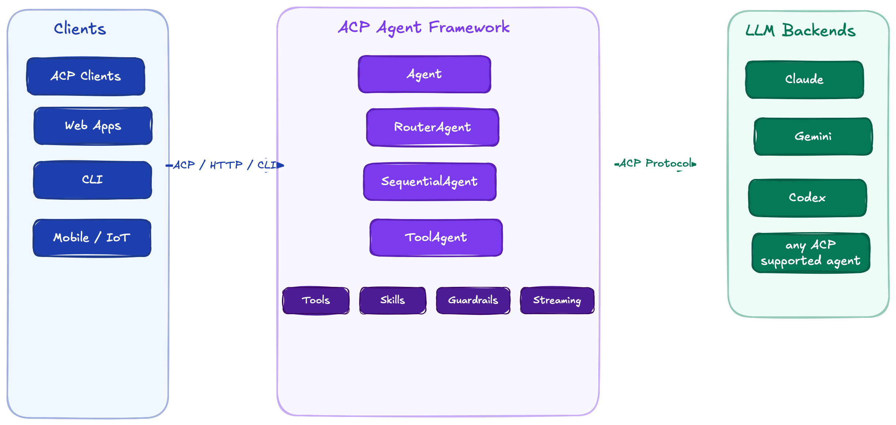
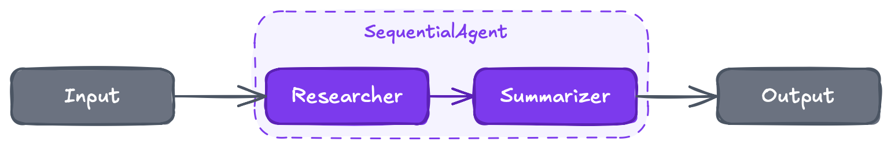
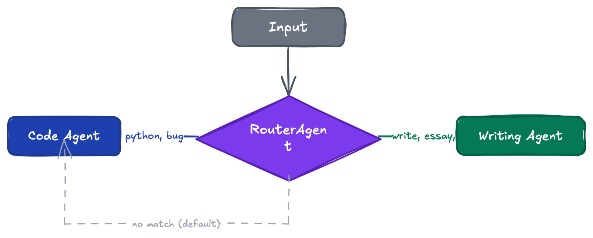
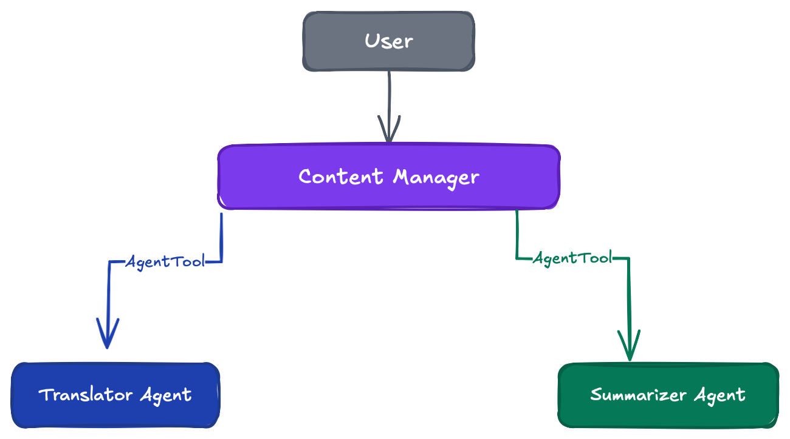
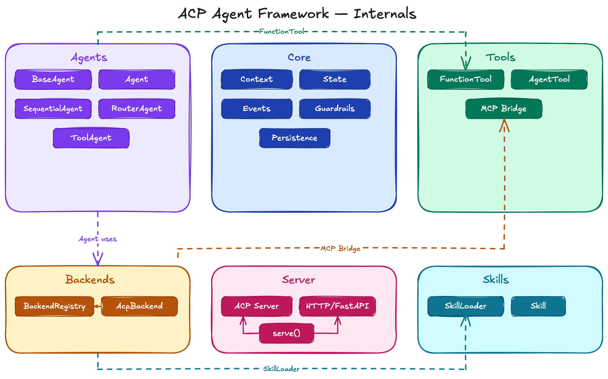

<div align="center">

# ACP Agent Framework

**Build custom AI agents using your existing subscriptions. No API keys. No vendor lock-in.**

[](https://www.python.org/downloads/)
[](LICENSE)
[](https://github.com/sanjay3290/agentic-framework-acp/actions/workflows/ci.yml)
[](https://pypi.org/project/acp-agent-framework/)
[](https://agentclientprotocol.com/)

The first open-source Python framework for building agents that speak the
[Agent Client Protocol (ACP)](https://agentclientprotocol.com/).

</div>

---

## How It Works

<p align="center">
  
</p>

## Why ACP?

| | Traditional Agent Frameworks | ACP Agent Framework |
|---|---|---|
| **Auth** | Manage API keys per provider | Use your existing AI subscriptions |
| **Protocol** | Proprietary APIs, custom integrations | Open standard (ACP) — works with any ACP client |
| **Lock-in** | Tied to one LLM provider | Swap backends with one line: `backend="gemini"` |

## Features

| Feature | Description |
|---|---|
| **Multi-Backend** | Claude, Gemini, Codex — swap with a single parameter |
| **Agent Orchestration** | Sequential pipelines, keyword routing, agent-to-agent delegation |
| **Tool Calling** | Wrap any Python function as an MCP tool the LLM can invoke |
| **Streaming** | Real-time token-by-token output via async generators |
| **Multi-Turn** | Conversation history maintained across prompts |
| **Guardrails** | Input/output validation hooks — redact PII, block injections |
| **Skills** | Load reusable agent capabilities per [agentskills.io](https://agentskills.io) spec |
| **Serving** | ACP stdio (editors), HTTP/SSE (web apps), CLI |
| **Session Persistence** | Save and restore sessions as JSON |

## Install

```bash
pip install acp-agent-framework
```

For development:

```bash
git clone https://github.com/sanjay3290/agentic-framework-acp.git
cd agentic-framework-acp
pip install -e ".[dev]"
```

## Quick Start

### Simple Agent

```python
from acp_agent_framework import Agent, serve

agent = Agent(
    name="assistant",
    backend="claude",  # or "gemini" or "codex"
    instruction="You are a helpful coding assistant.",
)

serve(agent)  # Serves over ACP stdio
```

### Sequential Pipeline

Chain agents — each one's output feeds into the next:

<p align="center">
  
</p>

```python
from acp_agent_framework import Agent, SequentialAgent, serve

researcher = Agent(
    name="researcher",
    backend="claude",
    instruction="Research the given topic thoroughly.",
    output_key="research",
)

summarizer = Agent(
    name="summarizer",
    backend="claude",
    instruction=lambda ctx: f"Summarize:\n\n{ctx.state.get('research', '')}",
)

pipeline = SequentialAgent(name="research-pipeline", agents=[researcher, summarizer])
serve(pipeline)
```

### Router Agent

Route requests to specialists based on keywords:

<p align="center">
  
</p>

```python
from acp_agent_framework import Agent, Route, RouterAgent, serve

code_agent = Agent(name="coder", backend="claude", instruction="Help with code.")
writing_agent = Agent(name="writer", backend="gemini", instruction="Help with writing.")

router = RouterAgent(
    name="smart-router",
    routes=[
        Route(keywords=["code", "python", "bug"], agent=code_agent),
        Route(keywords=["write", "essay", "email"], agent=writing_agent),
    ],
    default_agent=code_agent,
)

serve(router)
```

### Custom Tools

Wrap Python functions as tools the LLM can invoke via MCP:

```python
from acp_agent_framework import Agent, FunctionTool, serve

def search_docs(query: str) -> str:
    """Search documentation for a query."""
    return f"Results for: {query}"

agent = Agent(
    name="tool-agent",
    backend="claude",
    instruction="Use tools to help the user.",
    tools=[FunctionTool(search_docs)],
)

serve(agent)
```

> Tools are bridged to the backend via MCP — each `FunctionTool` is exposed as an MCP tool that the LLM can call during inference.

### ToolAgent (No LLM Needed)

For deterministic workflows and data pipelines:

```python
from acp_agent_framework import ToolAgent, FunctionTool, Context

async def build_report(ctx, tools):
    data = tools["fetch_data"].run({"source": "api"})
    return tools["format_report"].run({"data": data})

agent = ToolAgent(
    name="reporter",
    tools=[FunctionTool(fetch_data), FunctionTool(format_report)],
    execute=build_report,
    output_key="report",
)
```

### Guardrails

Validate and transform inputs/outputs:

```python
from acp_agent_framework import Agent, Guardrail, serve

agent = Agent(
    name="safe-agent",
    backend="claude",
    instruction="Be helpful.",
    input_guardrails=[
        Guardrail("pii-redact", lambda t: t.replace("SSN: 123-45-6789", "SSN: [REDACTED]")),
    ],
    output_guardrails=[
        Guardrail("length-limit", lambda t: t[:500] + "..." if len(t) > 500 else t),
    ],
)
```

### Agent Skills

Load reusable capabilities per the [agentskills.io](https://agentskills.io) spec:

```python
agent = Agent(
    name="chat-agent",
    backend="claude",
    instruction="You are a helpful assistant.",
    skills=["google-chat"],  # loads from .agents/skills/google-chat/SKILL.md
)
```

### Streaming

Real-time token-by-token output:

```python
agent = Agent(name="storyteller", backend="gemini", instruction="Write stories.", stream=True)

async for event in agent.run(ctx):
    if event.type == "stream_chunk":
        print(event.content, end="", flush=True)
```

### Agent-to-Agent Delegation

Wrap any agent as a tool for another agent:

<p align="center">
  
</p>

```python
from acp_agent_framework import Agent, AgentTool, serve

translator = Agent(name="translator", backend="gemini", instruction="Translate text.")
summarizer = Agent(name="summarizer", backend="claude", instruction="Summarize text.")

manager = Agent(
    name="content-manager",
    backend="claude",
    instruction="Use translator and summarizer tools to help the user.",
    tools=[AgentTool(translator, cwd="."), AgentTool(summarizer, cwd=".")],
)

serve(manager)
```

## Serving Agents

| Transport | Use Case | Command |
|---|---|---|
| **ACP stdio** | ACP-compatible clients | `serve(agent)` |
| **HTTP/SSE** | Web apps, APIs | `serve(agent, transport="http", port=8000)` |
| **CLI** | Terminal | `acp-agent run module:agent` |

### HTTP Endpoints

| Method | Endpoint | Description |
|---|---|---|
| `POST` | `/api/sessions` | Create session |
| `GET` | `/api/sessions/{id}` | Get session info |
| `DELETE` | `/api/sessions/{id}` | Delete session |
| `POST` | `/api/sessions/{id}/prompt` | Prompt with SSE streaming |

### CLI

```bash
acp-agent init my-agent                            # Scaffold a new project
acp-agent run my_agent.agent:agent                 # Run over ACP stdio
acp-agent run my_agent.agent:agent -t http -p 8000 # Run as HTTP server
```

## Supported Backends

| Backend | Command | Install |
|---|---|---|
| **Claude** | `claude-agent-acp` | `npm i -g @zed-industries/claude-agent-acp` |
| **Gemini** | `gemini --experimental-acp` | `npm i -g @google/gemini-cli` |
| **Codex** | `codex-acp` | `npm i -g @zed-industries/codex-acp` |

Register custom backends:

```python
from acp_agent_framework import BackendConfig, BackendRegistry

registry = BackendRegistry()
registry.register("my-backend", BackendConfig(
    command="my-agent-binary",
    args=["--acp"],
))
```

## Architecture

<p align="center">
  
</p>

## Testing

```bash
# Unit tests (158 tests)
pytest tests/ -v

# Integration tests (requires backends installed)
pytest tests/ -v -m integration

# Lint
ruff check src/ tests/
```

## Examples

Check the [`examples/`](examples/) directory for complete working agents:

| Example | Description |
|---|---|
| [`simple_agent`](examples/simple_agent/) | Minimal agent with a single backend |
| [`function_tools`](examples/function_tools/) | Weather, calculator, and unit converter tools |
| [`tool_agent`](examples/tool_agent/) | Hacker News digest without an LLM |
| [`guardrails`](examples/guardrails/) | PII redaction and injection blocking |
| [`streaming`](examples/streaming/) | Real-time token streaming |
| [`multi_turn`](examples/multi_turn/) | Conversational agent with history |
| [`router_agent`](examples/router_agent/) | Keyword-based routing |
| [`sequential_pipeline`](examples/sequential_pipeline/) | Multi-step agent chain |
| [`agent_to_agent`](examples/agent_to_agent/) | Manager delegating to specialists |

## Contributing

See [CONTRIBUTING.md](CONTRIBUTING.md) for development setup and guidelines.

## License

[MIT](LICENSE)
